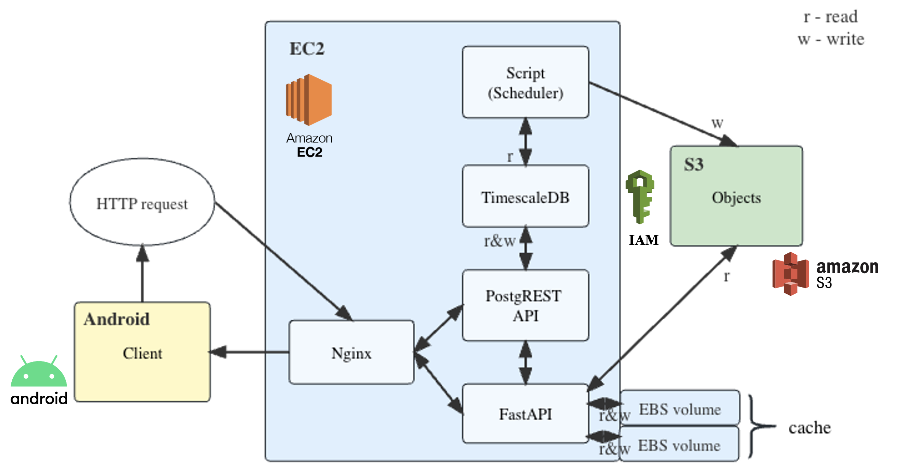
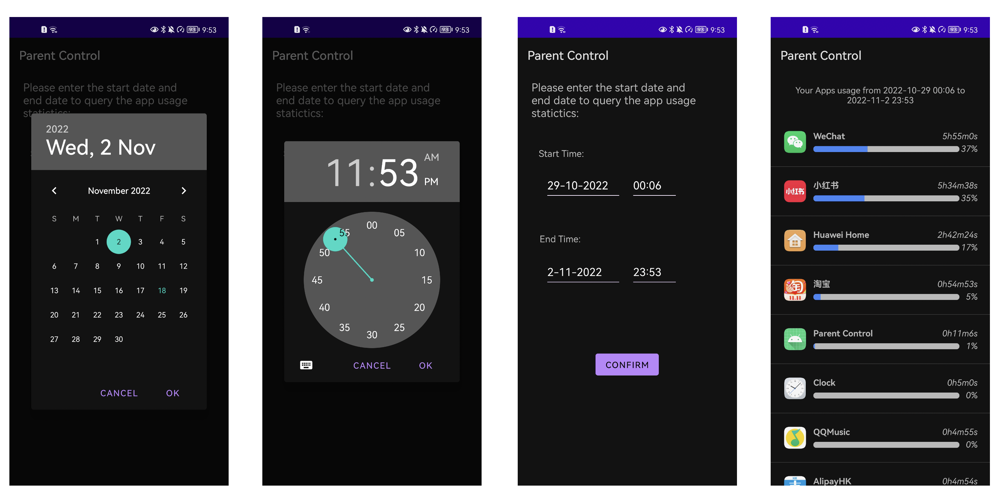

# ESTR4998 & ESTR4999 Graduation Thesis
Parent Control, a cloud-based time-series data management system with an Android client for phone usage tracking. The data management system contains two storage tiers, AWS EC2 and S3. Different pricing models of EC2 and S2 are used to build a caching system, including a time-related probabilistic online scheme and a deterministic scheme. The time-series data storage cost is optimized using the cache model.

## Objectives
1. **Time-Series Data Management**: Utilize TimescaleDB and cloud services to manage time-series data effectively.
2. **Cost Efficiency**: Implement a system that balances query performance and cost.
3. **Real-World Application**: Apply the system in a real scenario for tracking Android screen usage.

## Project Components
- **Android App**: Collects and queries app usage data.
- **Cloud Services**: Utilizes Amazon EC2 and S3 for data storage, tiering, and caching.
- **Caching Schemes**: Research and optimize caching schemes to minimize costs.
- **Benchmarking**: Evaluate the system using Time Series Benchmark Suite (TSBS) and real scenario simulations.

## System Architecture

## Part 1: Android App Development

### Overview
The Android application, titled "Parent Control", is developed for tracking app usage statistics on Android devices. It functions as the client-side component of a cloud-based time-series data management system. The app allows users to insert their app usage data, either automatically or manually, and view statistical reports within a selected time range.

### Features
1. **Homepage**: Access to automatic and manual data insertion, and app usage queries.
2. **Data Insertion**: Two modes - automatic insertion and manual insertion of app usage data within a specified time range.
3. **Query Engine**: Users can input a time interval and retrieve app usage statistics.

## Part 2: EC2 Cloud Services Development

Handle data tiering services and deploy TimescaleDB for hot data storage.

### Key Components
1. **TimescaleDB Deployment**: Utilization of TimescaleDB for managing time-series data.
2. **PostgREST Setup**: Configuration of PostgREST for RESTful API access to the PostgreSQL database.
3. **FastAPI Integration**: Implementation of FastAPI for efficient query processing and data management.
4. **Data Tiering Strategy**: A systematic approach to data storage, optimizing for cost and performance.
5. **Nginx Configuration**: Use of Nginx for load balancing and improved performance.

## Part 3: S3 Storage and Indexing

Used as a cheaper tire to store and manage the old data chunks.

### Key Features
1. **Indexing Mechanism**: Efficient indexing strategy for stored data, optimizing retrieval performance.
2. **Data Upload**: Process and methodology for uploading time-series data to S3.
3. **Data Retrieval**: Retrieval mechanisms for efficiently accessing data stored in S3.
4. **Data Format**: Store the app usage data in S3 as .csv for better performance and cost-efficiency.

### Benefits
- **Cost-Efficiency**: Reduced storage costs while maintaining data accessibility.
- **Scalability and Security**: Utilization of S3's scalable and secure storage solutions.

## Part 4: Caching

S3 is used to store the cold data, and EBS volume serves as the scalable caching space.

### Caching Schemes
1. **Deterministic caching scheme**: Accessed data will be stored in the cache for a fixed time.
2. **Probabilistic caching scheme**: Accessed data will be stored in the cache for a "random" time, calculated from the data's timestamp and a probabilistic function.

### Caching Implementation
1. If some data is accessed from S3, then the data will be added to the cache. The upload time is when it is added to the cache, and the eviction time is obtained from the upload time and the eviction policy under the caching scheme in use (deterministic caching scheme or probabilistic caching scheme, as researched in this project).
2. If some data is accessed from the cache, then the metadata of these data will be updated. The upload time is the new access time, and the eviction time is obtained from the upload time and the caching scheme.
3. Every hour, we check whether some EBS volume is empty (i.e., there is no more cached data there). If so, we will detach and delete that EBS volume. The checking time is set to an hourly basis, because once an EBS volume is allocated, it charges for the next hour, and it would be wasteful to deallocate it before the end of an hour.
4. Every m minutes, we scan through the evict time column of the cache metadata and check whether there is some data that exceeds the eviction time. If so, we will delete the metadata, and also remove the app usage data records according to the start time and end time in the metadata. m is 10 minutes in this implementation.
5. A cache limit is set manually. Each time we add new data to the cache, we will check whether we need to allocate a new EBS volume, and also check whether the total amount of data will exceed this limit. If it doesn’t exceed the limit but the current EBS volumes are not enough, then a new EBS volume will be created, attached, and mounted. If it exceeds the limit, the least recently used data will be evicted until there is enough space for the newly added data.
6. By default, the recent uploaded app usage data is stored in EC2, and the old app usage data is stored in S3. The caching implementation still preserves the data tiering policy.
